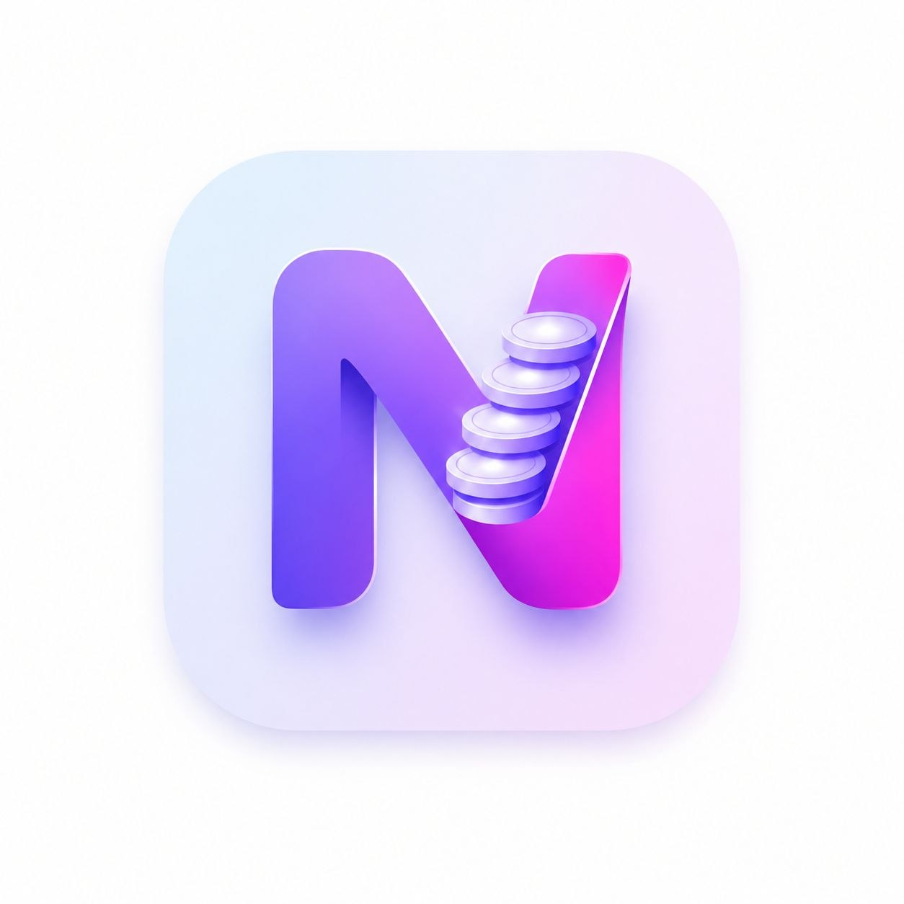
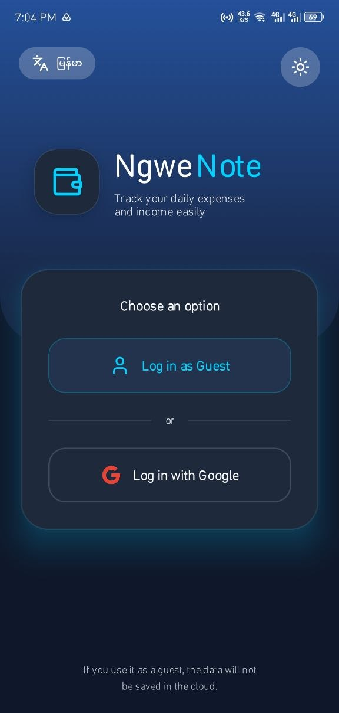
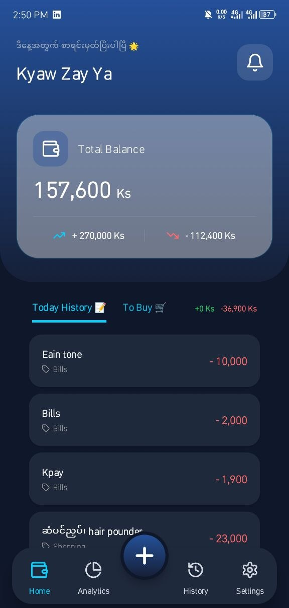
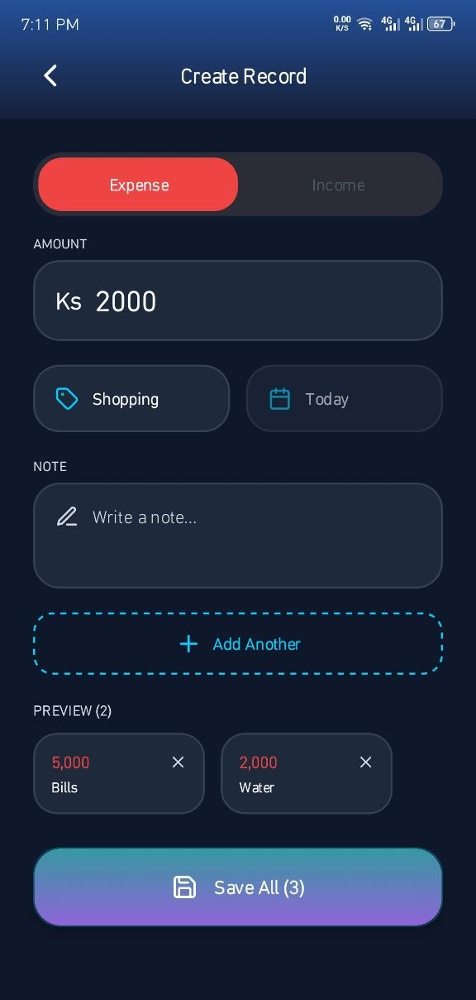
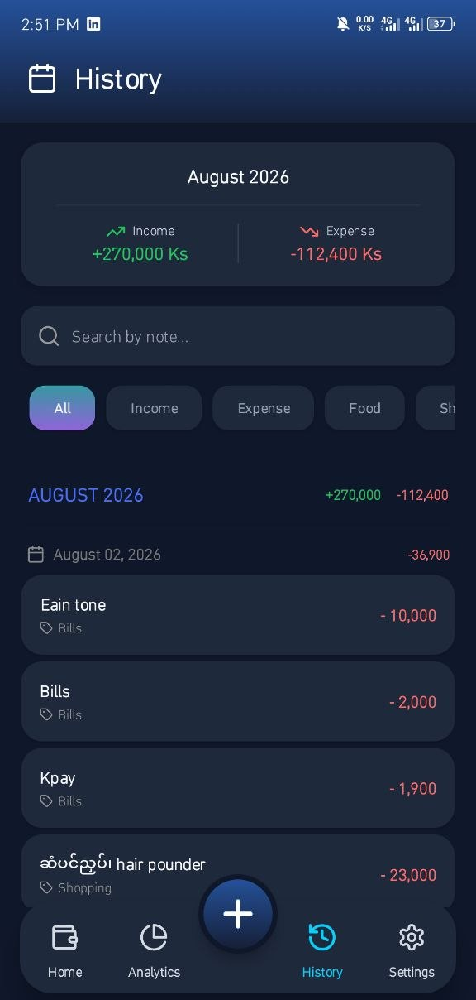
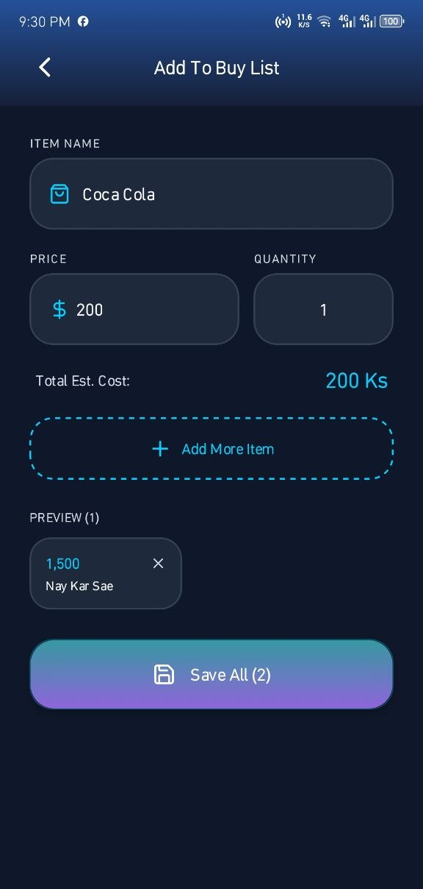
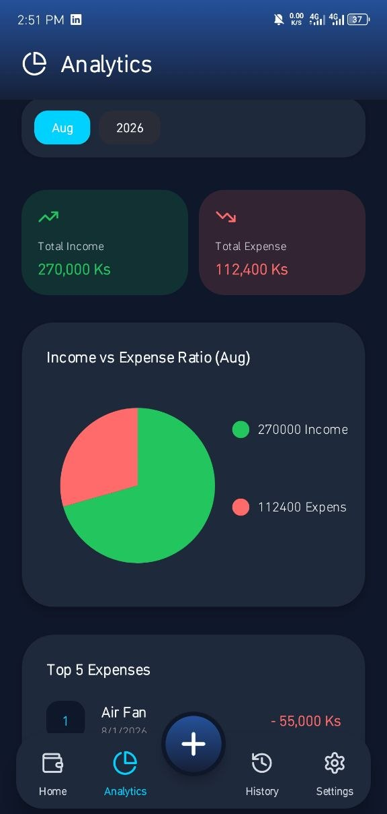
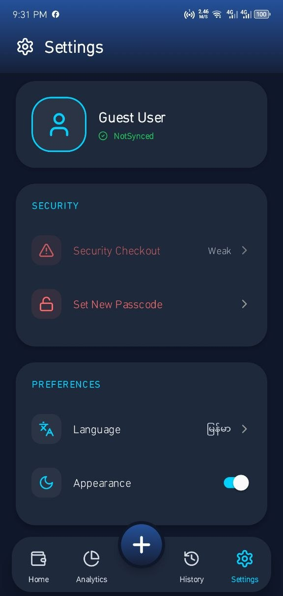
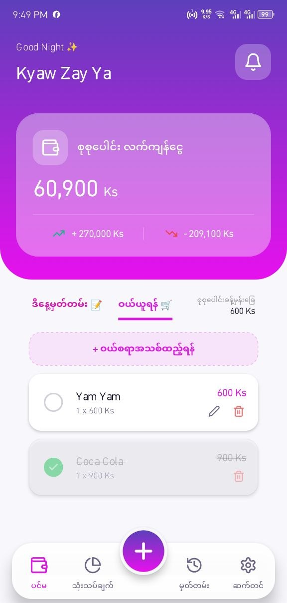

<div align="center">

#  NgweNote

### Personal Finance & Expense Tracker

**A simple and modern Android application for managing your daily income and expenses.**

<br />


<br /><br />

<a href="https://kyawzayya.vercel.app">
  
</a>

<a href="https://github.com/KyawZayYa-c/NgweNote">
  
</a>

<a href="https://github.com/KyawZayYa-c/NgweNote/issues">
  
</a>

</div>

---

## 📱 About The Project

**NgweNote (ငွေနုတ်)** is a personal finance and expense tracking application developed with **React Native**.

The main purpose of NgweNote is to make everyday money management simple and convenient.

Users can record their income and expenses, review transaction history, manage shopping items, and view financial information through a clean and modern mobile interface.

The application is currently available for **Android only**.

> 📌 **Platform:** Android
> 🚧 **Web:** Not available yet
> 🚧 **iOS:** Not available yet

---

## ✨ Features

### 💵 Income & Expense Management

- Add income
- Add expenses
- Select transaction categories
- Add transaction notes
- Select transaction dates
- View current balance
- View today's income
- View today's expenses
- Add multiple transactions

### 🛒 Shopping List

- Create shopping items
- Add items to the shopping list
- Manage shopping items
- Convert shopping items into transactions

### 📜 Transaction History

- View all previous transactions
- Group transactions by month
- Group transactions by day
- Search transactions
- Filter transactions
- Review transaction details

### 📊 Financial Analytics

- Monthly financial overview
- Yearly financial overview
- Income and expense visualization
- View top expenses
- Export analytics information as an image

### 🔐 Security

- 4-digit PIN protection
- PIN protection for sensitive edit/delete actions
- Google Sign-In
- Firebase Authentication
- Guest mode
- Data reset option

### 🎨 User Interface

- 🌙 Dark Mode
- ☀️ Light Mode
- 🇲🇲 Myanmar language
- 🇬🇧 English language
- ✨ Modern card-based interface
- 💎 Glass-style UI elements
- 🎞️ Smooth animations
- 🔔 Custom alerts and dialogs

### ☁️ Firebase Integration

NgweNote is connected with Firebase for application services such as:

- Authentication
- Firestore data storage
- User data synchronization
- Notification-related functionality

---

## 🖼️ Screenshots

<div align="center">

<table>
  <tr>
    <td align="center"><b>🔐 Login</b></td>
    <td align="center"><b>🏠 Home</b></td>
    <td align="center"><b>💰 Add Transaction</b></td>
    <td align="center"><b>📜 History</b></td>
    
  </tr>
  <tr>
    <td></td>
    <td></td>
    <td></td>
    <td></td>
  </tr>
  <tr>
    <td align="center"><b>🛒 Add To Buy</b></td>
    <td align="center"><b>📊 Analytics</b></td>
    <td align="center"><b>⚙️ Settings</b></td>
    <td align="center"><b>🔐 To Buy</b></td>
  </tr>
  <tr>
    <td></td>
    <td></td>
    <td></td>
    <td></td>
  </tr>
</table>

</div>

---

## 🛠️ Technology

### React Native

NgweNote is developed using **React Native** to build the Android mobile application.

### TypeScript

TypeScript is used throughout the application for better code organization and type safety.

### Firebase

Firebase is integrated into the application for authentication and cloud data-related functionality.

### Expo

Expo is used as part of the React Native development and build environment.

---

## 📁 Project Structure

```text
NgweNote/
│
├── assets/
│   ├── adaptive-icon.png
│   ├── favicon.png
│   ├── icon.png
│   └── splash-icon.png
│
├── screenshots/
│   ├── home.png
│   ├── add-transaction.png
│   ├── analytics.png
│   ├── history.png
│   ├── shopping.png
│   ├── settings.png
│   ├── login.png
│   └── demo.gif
│
├── src/
│   │
│   ├── components/
│   │   ├── AddToBuy/
│   │   ├── AddTransaction/
│   │   ├── Analytics/
│   │   ├── History/
│   │   ├── Home/
│   │   ├── Login/
│   │   ├── Settings/
│   │   ├── CategoryModal.tsx
│   │   ├── ShoppingCard.tsx
│   │   └── ShoppingSection.tsx
│   │
│   ├── context/
│   │   ├── useAuthStore.ts
│   │   ├── useExpenseStore.ts
│   │   └── useThemeStore.ts
│   │
│   ├── i18n/
│   │   └── index.ts
│   │
│   ├── navigation/
│   │   └── AppNavigator.tsx
│   │
│   ├── screens/
│   │   ├── AddToBuyScreen.tsx
│   │   ├── AddTransactionScreen.tsx
│   │   ├── AnalyticsScreen.tsx
│   │   ├── HistoryScreen.tsx
│   │   ├── HomeScreen.tsx
│   │   ├── LoginScreen.tsx
│   │   └── SettingsScreen.tsx
│   │
│   ├── services/
│   │   ├── firebaseConfig.ts
│   │   └── firestoreService.ts
│   │
│   ├── theme/
│   │   ├── colors.ts
│   │   └── fontSize.ts
│   │
│   ├── types/
│   │   └── env.d.ts
│   │
│   └── utils/
│       ├── dateHelpers.ts
│       └── formatCurrency.ts
│
├── .env
├── .env.example
├── .gitignore
├── App.tsx
├── app.json
├── babel.config.js
├── eas.json
├── index.ts
├── package.json
├── tsconfig.json
└── README.md
```

---

## 🚀 Getting Started

### Prerequisites

Before running the project, make sure you have:

- Node.js
- npm or yarn
- Expo
- Android Studio
- Android Emulator or Android Device
- Firebase account

---

### 1. Clone The Repository

```bash
git clone https://github.com/KyawZayYa-c/NgweNote.git
cd NgweNote
```

---

### 2. Install Dependencies

Using npm:

```bash
npm install
```

Or using yarn:

```bash
yarn install
```

---

### 3. Configure Environment Variables

Create a `.env` file in the project root.

```env
FIREBASE_API_KEY=your_api_key_here
FIREBASE_AUTH_DOMAIN=your_project.firebaseapp.com
FIREBASE_PROJECT_ID=your_project_id
FIREBASE_STORAGE_BUCKET=your_project.appspot.com
FIREBASE_MESSAGING_SENDER_ID=your_sender_id
FIREBASE_APP_ID=your_app_id
FIREBASE_MEASUREMENT_ID=your_measurement_id
FIREBASE_DATABASE_URL=your_database_url

GOOGLE_WEB_CLIENT_ID=your_google_web_client_id
```

You can also copy the example environment file:

```bash
cp .env.example .env
```

---

### 4. Firebase Configuration

Open the Firebase Console:

[https://console.firebase.google.com/](https://console.firebase.google.com/)

Then configure the required Firebase services for the project.

The Firebase configuration values should be stored inside `.env`.

> ⚠️ Never commit your `.env` file or private credentials to GitHub.

---

### 5. Start The Application

```bash
npx expo start
```

Then run the application on an Android device or emulator.

For Android emulator:

```text
Press A
```

Or scan the Expo QR code with a compatible Android device.

---

## 🔥 Firebase Setup

NgweNote uses Firebase integration for application services.

### Firebase Authentication

Firebase Authentication is used for user authentication and Google Sign-In.

### Firestore

Firestore is used for storing and synchronizing application data.

### Security

Keep Firebase configuration values and other sensitive credentials out of the public repository.

Make sure `.env` is included in `.gitignore`.

Example:

```gitignore
.env
node_modules/
google-services.json
```

---

## 📲 Download Android APK

<div align="center">

### Get NgweNote for Android

<a href="https://drive.google.com/file/d/1YppDBYrqDcUZzJtyEO3kDv-FCoHmH0Ix/view?usp=drive_link">


</a>

<br /><br />

**NgweNote v1.0.0**

</div>

### Installation

1. Download the APK
2. Open the downloaded APK
3. Allow installation from unknown sources if Android requests permission
4. Install NgweNote
5. Open the application
6. Start managing your finances

> 📌 NgweNote is currently available for Android only.

---

## 🤝 Contributing

Contributions, suggestions, bug reports, and feature requests are welcome.

### Contribution Workflow

```bash
# Create a new branch
git checkout -b feature/new-feature

# Make your changes

# Stage your changes
git add .

# Commit your changes
git commit -m "feat: add new feature"

# Push the branch
git push origin feature/new-feature
```

Then open a Pull Request on GitHub.

---

## 🐛 Bug Reports & Feature Requests

If you find a bug or have an idea for a new feature, please open an issue:

[https://github.com/KyawZayYa-c/NgweNote/issues](https://github.com/KyawZayYa-c/NgweNote/issues)

When reporting a bug, please include:

- What happened
- What you expected
- Steps to reproduce
- Android version
- Device model
- Screenshot if possible

---

## 📄 License

This project is licensed under the **MIT License**.

See the [LICENSE](./LICENSE) file for full details.

Copyright (c) 2026 Kyaw Zay Ya

---

## 👨‍💻 Author

<div align="center">

# Kyaw Zay Ya

### Junior Full Stack Developer

<br />

<a href="https://kyawzayya.vercel.app">


</a>

<a href="https://github.com/KyawZayYa-c">


</a>

<br /><br />

<a href="https://github.com/KyawZayYa-c/NgweNote">


</a>

</div>

---

## 🙏 Acknowledgments

Special thanks to the technologies and open-source tools used in this project:

- React Native
- Expo
- Firebase
- Lucide Icons
- Open-source community

---

<div align="center">

## ⭐ NgweNote

**A simple way to keep track of your money.**

<br />

<a href="https://github.com/KyawZayYa-c/NgweNote">
  ⭐ Star this repository
</a>

<br /><br />

<a href="https://kyawzayya.vercel.app">
  🌐 Visit My Portfolio
</a>

<br /><br />

**Made with ❤️ in Myanmar 🇲🇲**

</div>